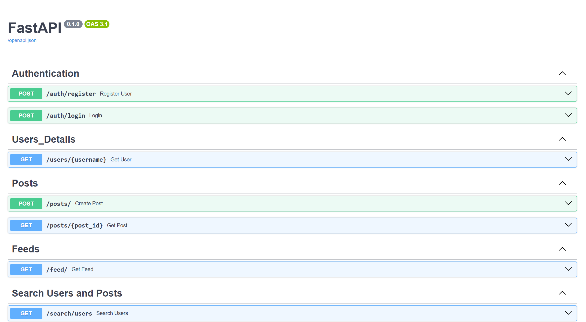

# Implementing an application like Instagram - FastAPI

## How to Execute
- Create an env environment
  `python -m venv .venv`
- Activate the environment
  `source .venv/Scripts/activate (bash)`
- Install all dependencies
  `pip install -r requirements.txt`
- Run the program 
  `Uvicorn app.main:app --reload`
- Open the browser and navigate to  
  [http://127.0.0.1:8000](http://127.0.0.1:8000)

## Validate the API documentation on
[http://127.0.0.1:8000/docs](http://127.0.0.1:8000/docs)

## Used Tech Stacks
- MongoDB
- FastAPI
- Python
- Pydantic
- Uvicorn

